# D.E.M. Slicer

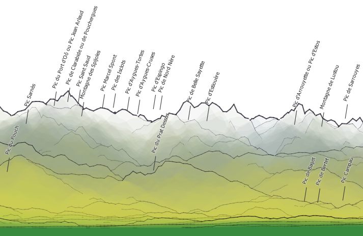

Il s'agit d'un outil simple de découpe (en tranches !) de MNT, pour dessiner de jolies cartes postales, pour les amoureux de reliefs. 

Le principe est de générer une série de profils d'altitudes (sous forme de lignes ou de polygones), de les juxtaposer pour donner l'illusion d'une vue 3D. Ici, pas de calcul de l'indice de réfraction atmosphérique, pas de prise en compte de la courbure terrestre... juste un peu de géométrie, et les styles font le reste. Les couches résultantes sont positionnées où bon vous semble, le système de coordonnées utilisé est celui de la carte.

Les décalages (variés selon les paramètres retenus) en hauteur de chaque coupe simulent des vues parallèles ou 'perspective', une vision 'panoramique' tente de se rapprocher de la vision que peut avoir un observateur.

## Les prérequis
- disposer d'un image (raster) d'altitude (MNT). différentes sources possibles : https://dwtkns.com/srtm30m/, https://opendem.info, https://grindgis.com/data/free-world-dem-data
- de travailler dans une projection dont l'unité coincide avec l'unité altimétrique du MNT (le mètre par exemple pour la projection Lambert93). 

## Exemples

### Un fonctionnement basique. 
Choix de la zone (utilisation des poignées), sélection de la couche qui porte les altitudes, ajustement de quelques paramètres et résultats  : 

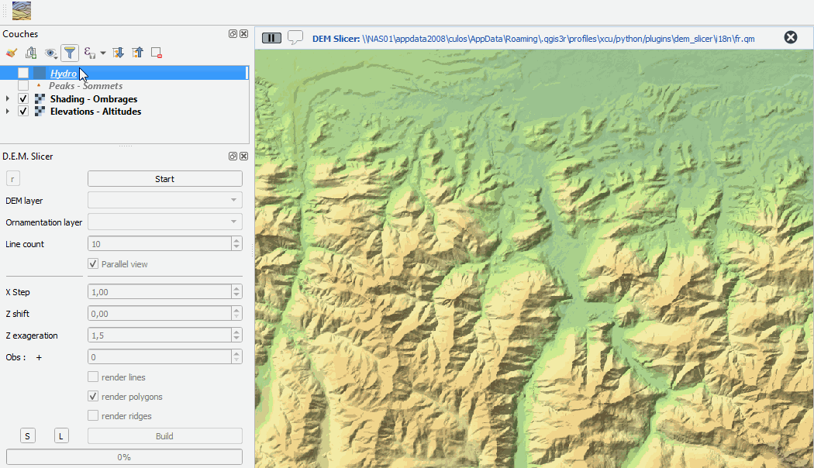

### La vue 'panoramique' :
Les tranches de terrain suivent alors des arcs de cercle d'iso-distance à l'observateur.

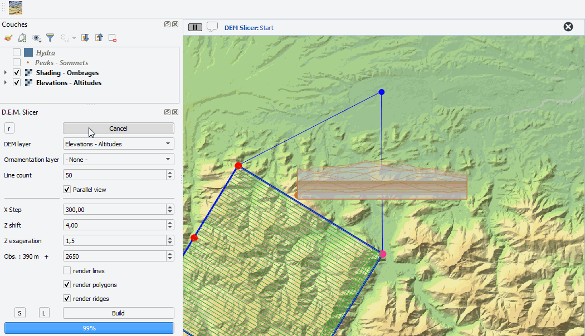

### Ornementations...

La couche de points choisie sera 'projetée' sur les coupes. Un attribut indique si le point ainsi projeté est visible (masqué ou non par une coupe). Le style par défaut utilise les champs 'nom', 'name' ou 'label' pour étiquetage.
Une couche de ligne ou polygones sera découpée par les lignes de profils, chaque sommet replacé en altitude. Résultat souvent mal fichu et très gourmant. Attention : annulation impossible, faire des tests sur petit jeu de données.

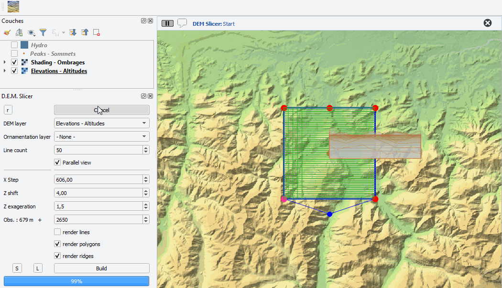

## Les couches produites 

### Lignes
Attributs : 

    "num" - numéro de la ligne. Le zéro commençant au fond.

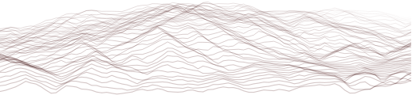

### Polygones 
Attributs : 

    "num" - numéro du polygone. Le zéro commençant au fond.

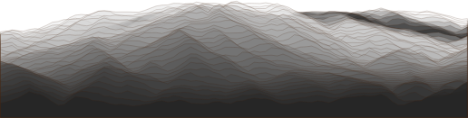

### Crêtes
Attributs : 

    "num" - numéro de la ligne. 
    "gaz" - nombre de coupes que cette crête masque.  
    "prof" - 'profondeur' de la crête (0 = proche...)

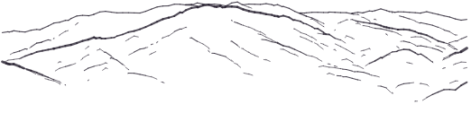

### Ornementation (points)
Attributs (ajoutés aux attributs de la couche originale) : 

    "num" - numéro du point. 
    "z" - altitude calculée.  
    "depth" - distance à l'observateur
    "visi" - visibilité dans la série de coupe (0 : masqué, 1 : visible)

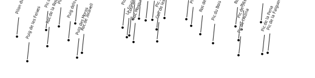

## Les paramètres en détail

linecount : c'est tout simplement le nombre de profils (de coupes) générés.
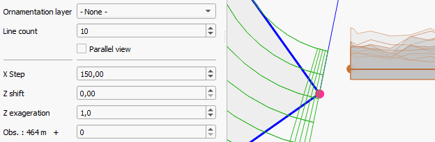

xStep : distance entre deux mesures d'altitude, le long des profils. 
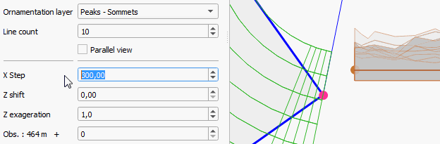

zShift : décalage vertical des coupes. Rend plus visible les coupes qui sont en arrière plan. Effet 'vue aérienne'.
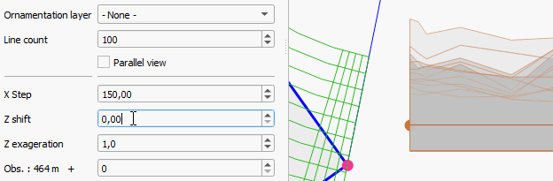

zFactor : Exagération du relief.
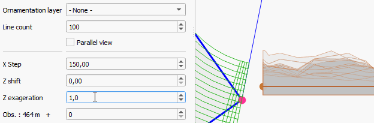

elevation : Altitude de l'observateur par rapport au sol. Comme 'zShift', influe sur le décalage vertical des coupes, en plus fidèle à la réalité. 
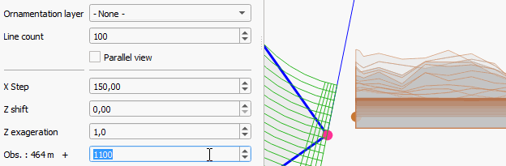

## Les styles... 

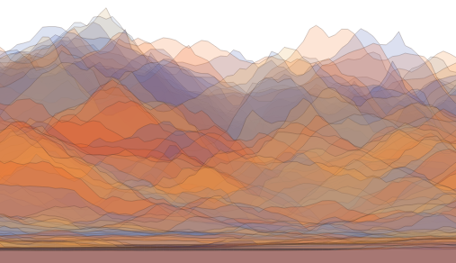

