

a QGis (3.10) plugin...

- [D.E.M. Slicer (en)](#dem-slicer-en)
  - [Prerequisites](#prerequisites)
  - [Examples](#examples)
    - [Basic use](#basic-use)
    - [Ergonomics](#ergonomics)
    - [Orthogonal view](#orthogonal-view)
    - [Ornementations](#ornementations)
  - [The layers produced](#the-layers-produced)
    - [Lines](#lines)
    - [Polygons](#polygons)
    - [Ridges](#ridges)
    - [Ornementation (points)](#ornementation-points)
    - [Compass](#compass)
  - [The parameters in detail](#the-parameters-in-detail)
  - [The styles](#the-styles)
- [D.E.M. Slicer (fr)](#dem-slicer-fr)
  - [Les prérequis](#les-prérequis)
  - [Exemples](#exemples)
    - [Un fonctionnement basique.](#un-fonctionnement-basique)
    - [Ergonomie](#ergonomie)
    - [La vue orthogonale](#la-vue-orthogonale)
    - [Ornementations](#ornementations-1)
  - [Les couches produites](#les-couches-produites)
    - [Lignes](#lignes)
    - [Polygones](#polygones)
    - [Crêtes](#crêtes)
    - [Ornementation (points)](#ornementation-points-1)
    - [Boussole](#boussole)
  - [Les paramètres en détail](#les-paramètres-en-détail)
  - [Les styles](#les-styles)

# D.E.M. Slicer (en)

It is a simple cutting tool (in slices) of DEM data, to draw pretty postcards, for lovers of reliefs.

The principle is to build a series of altitude profiles (lines or polygons), to juxtapose them to give the illusion of a 3D view. Here, no calculation of the atmospheric refractive index, no consideration of the Earth's curvature ... just a little geometry, and the styles do the rest. The resulting layers are positioned where you want, the coordinate system used is that of the map (prefer 3857 rather than 4326 -in degrees-).

The offsets (varied according to the parameters chosen) in height of each cut simulate parallel or perspective views, a 'radial' vision attempts to get closer to the vision that an observer can have.

A 'ridge line' calculation enhances the reliefs.

## Prerequisites
- have an altitude raster image. different possible sources: https://dwtkns.com/srtm30m/, https://opendem.info, https://grindgis.com/data/free-world-dem-data
- to work in a projection whose unit coincides with the altimetric unit of the DEM (3857, WGS 84 / Pseudo-Mercator for example).

## Examples

### Basic use
Choice of the zone (use of the handles), selection of the layer which carries the altitudes, adjustment of some parameters and results.

Default view : the profiles follow arcs of an iso-distance to the observer.

### Ergonomics

The different handles allow you to size, position the cuts and the final rendering.

The "sample" profiles are drawn immediately.

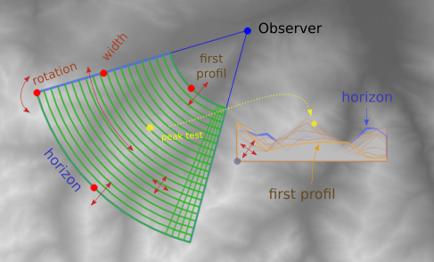

### Orthogonal view

### Ornementations

The selected point layer will be 'projected' on the profiles. An attribute indicates whether the point thus projected is visible (hidden or not by a section). The default style uses the fields 'name' or 'label' for labeling.

A line layer or polygons will be cut by the profile lines, each vertex replaced in altitude. Result often badly done and very time consuming. Please note: cancellation is not possible, test on small data set.

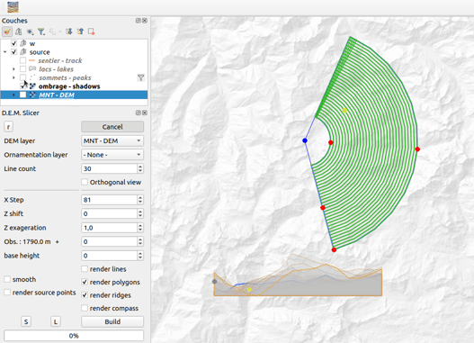

## The layers produced

### Lines
Attributes :

    "demslicer_cutid" - line number. Zero from the front.

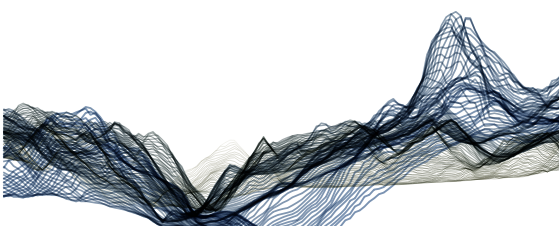

### Polygons
Attributes :

    "demslicer_cutid" - polygone number.

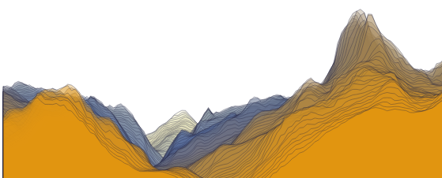

### Ridges
Attributes :

    "demslicer_gaz" - number of profiles that this crest hides
    "demslicer_cutid" - 'depth' of the ridge (0 = front...)

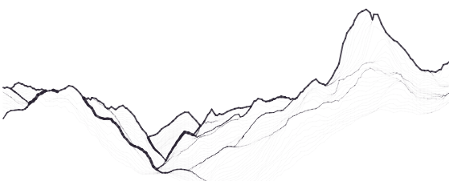

### Ornementation (points)
Attributes (added to the attributes of the original layer) :

    "demslicer_cutid" - depth.
    "demslicer_z" - calculated altitude.  
    "demslicer_dist" - distance to observer
    "demslicer_visi" - visibility in the cutting series (< 1: hidden, 1: visible)
    "demslicer_azimuth" - azimuth from observer

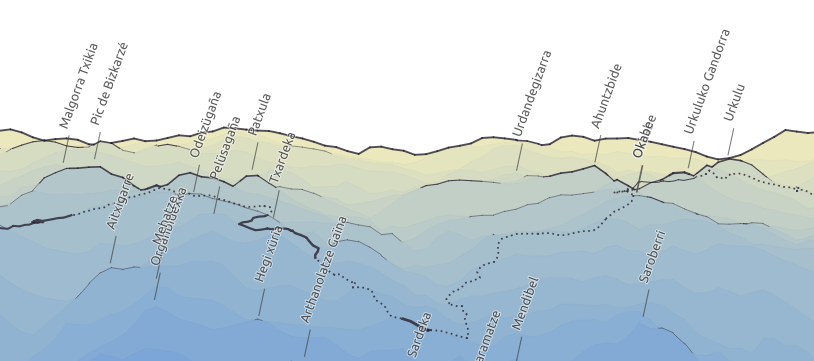

### Compass 

In perspective mode, possibility of producing a 'compass' layer to help localization, azimuth in x, angle of sight in relation to the horizontal in y.

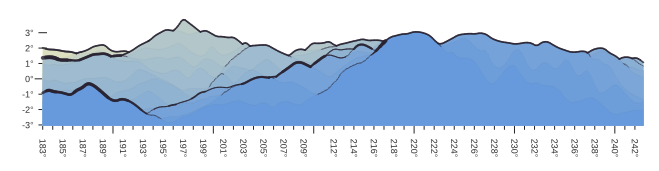

## The parameters in detail

linecount : it is simply the number of profiles (sections) generated.

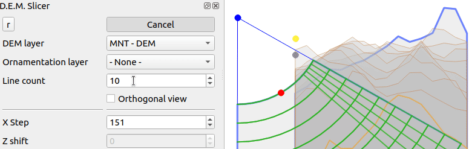

xStep : distance between two altitude measurements, along the profiles.

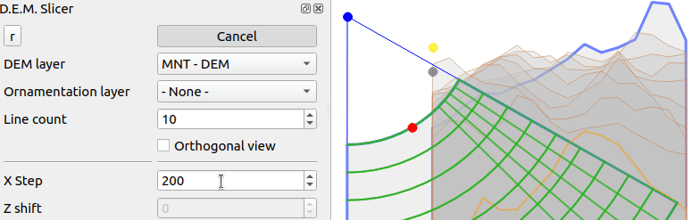

zShift : vertical offset of the profiles. Makes the cuts in the background more visible. 'Aerial view' effect (orthogonal mode only).

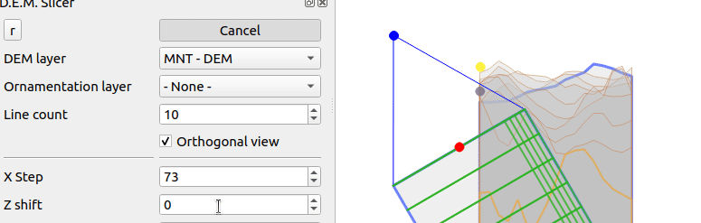

zFactor : accentuation of the relief.

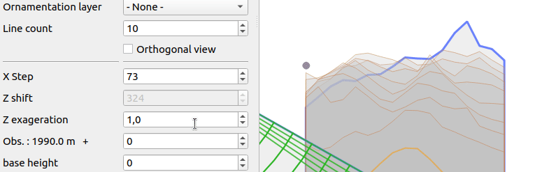

elevation : Altitude of the observer relative to the ground. Like 'zShift', influences the vertical offset of the sections, more faithful to reality in orthogonal mode.

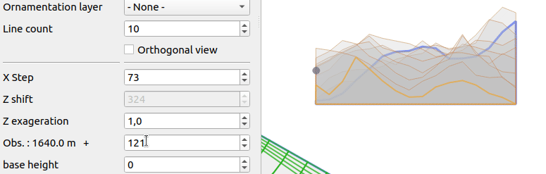

Base height.

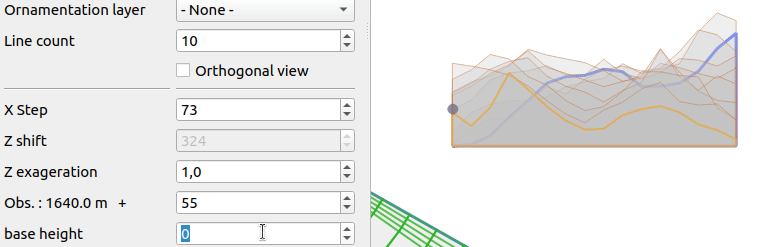

## The styles

Colors, transparency, texture ... everything is possible with QGis!

The attributes carried by the geometries can be used to adjust styles. For example, the thickness of the ridge lines can vary depending on the number of profiles that are hidden by the ridge (attribute 'demslicer_gaz') :

    scale_linear( coalesce( "demslicer_gaz", maximum("demslicer_gaz")/3) , 0, maximum("demslicer_gaz"), 0.05, 0.8)

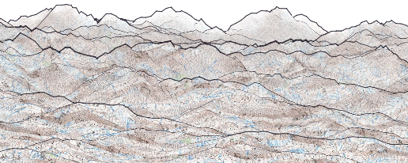

# D.E.M. Slicer (fr)

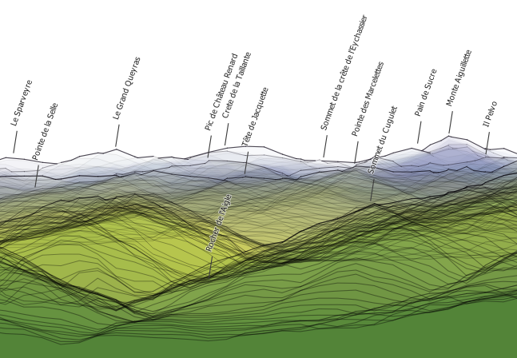

Il s'agit d'un outil simple de découpe (en tranches !) de Modèle numérique de terrain (MNT), pour produire de belles images à destination des amoureux de reliefs.

Le principe est de construire une série de profils d'altitudes (sous forme de lignes ou de polygones), de les juxtaposer pour donner l'illusion d'une vue 3D. Ici, pas de calcul de l'indice de réfraction atmosphérique, pas de prise en compte de la courbure terrestre... juste un peu de géométrie, et les styles font le reste. Les couches résultantes sont positionnées où bon vous semble, le système de coordonnées utilisé est celui de la carte (métrique).

La vue 'perspective' par défaut propose un rendu plus proche de la réalité (par rapport aux versions précédentes, et à la vue orthogonale).

Un calcul de 'ligne de crête' rehausse les reliefs.

La projection de points (sommets par exemple), de lignes (rivières ?), de polygones est vraiment une fonctionalité expérimentale (se méfier de la volumétrie).

## Les prérequis
- disposer d'un image (raster) d'altitude (MNT). différentes sources possibles : https://dwtkns.com/srtm30m/, https://opendem.info, https://grindgis.com/data/free-world-dem-data
- de travailler dans une projection dont l'unité coïncide avec l'unité altimétrique du MNT (le mètre par exemple pour la projection Lambert93 ou 3857, pseudo mercator).

## Exemples

### Un fonctionnement basique.
Choix de la zone (utilisation des poignées), sélection de la couche qui porte les altitudes, ajustement de quelques paramètres et résultats  :

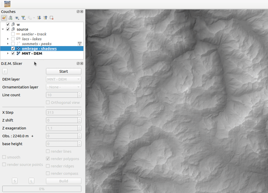

### Ergonomie

Les différentes poignées permettent de dimensionner, positionner les coupes et le rendu final.

Les profils "échantillons" se dessinent immédiatement.

### La vue orthogonale
Les coupes suivent alors des lignes droites, l'observateur n'est plus le "point bleu" mais se déplace latéralement. Les options de décalage des profils peuvent simuler une prise d'altitude.

### Ornementations

La couche de points choisie sera 'projetée' sur les coupes. Un attribut indique si le point ainsi projeté est masqué ou non par une coupe. Le style par défaut utilise les champs 'nom', 'name' ou 'label' pour étiquetage.

Une couche de ligne ou polygones sera découpée par les lignes de profils, chaque sommet de la géométrie replacé en altitude. Résultat souvent imparfait. Attention : annulation impossible, faire des tests sur petit jeu de données.

## Les couches produites

### Lignes
Attributs :

    "demslicer_cutid" - numéro de ligne (profondeur), le zéro plus proche de l'observateur.

### Polygones
Attributs :

    "demslicer_cutid" - numéro du polygone (profondeur), le zéro plus proche de l'observateur.

### Crêtes
Attributs :

    "demslicer_gaz" - nombre de profils que cette crête cache.
    "demslicer_cutid" - 'profondeur' de la crête (0 = proche...)

### Ornementation (points)
Attributs (ajoutés aux attributs de la couche originale) :

    "demslicer_cutid" - 'profondeur' de la crête (0 = proche...)
    "demslicer_z" - altitude calculée.  
    "demslicer_dist" - distance de l'observateur au point
    "demslicer_visi" - visibilité dans la série de coupe (< 1 : masqué, 1 : visible)
    "demslicer_azimuth"  - azimuth du point (visée à la boussole du point)

### Boussole

En mode perspective, possibilité de produire une couche 'boussole' d'aide à la localisation, azimuth en x, angle de visée par rapport à l'horizontale en y.

## Les paramètres en détail

Nombre de profils : c'est tout simplement le nombre de coupes générées.

Ecart entre deux mesures d'altitude : distance entre deux points, le long des profils.

Décalage des profils : décalage vertical des coupes. Rend plus visible les coupes qui sont en arrière plan. Effet 'vue aérienne', en mode orthogonal.

Accentuation du relief : Exagération du relief (multiplication).

Obs : Altitude de l'observateur par rapport au sol. 
En mode orthogonal, un décalage vertical des coupes, selon la distance à l'observateur simule la prise d'altitude.

Base : hauteur de la 'jupe'.

## Les styles

Couleurs, transparence, texture... tout est possible avec QGis !

Les attributs que portent les géométries peuvent servir à ajuster les styles. Par exemple, l'épaisseur des lignes de crête peut varier selon le nombre de profils qui sont cachés par la crête (attribut 'demslicer_gaz') :

    scale_linear( coalesce( "demslicer_gaz", maximum("demslicer_gaz")/3) , 0, maximum("demslicer_gaz"), 0.05, 0.8)
